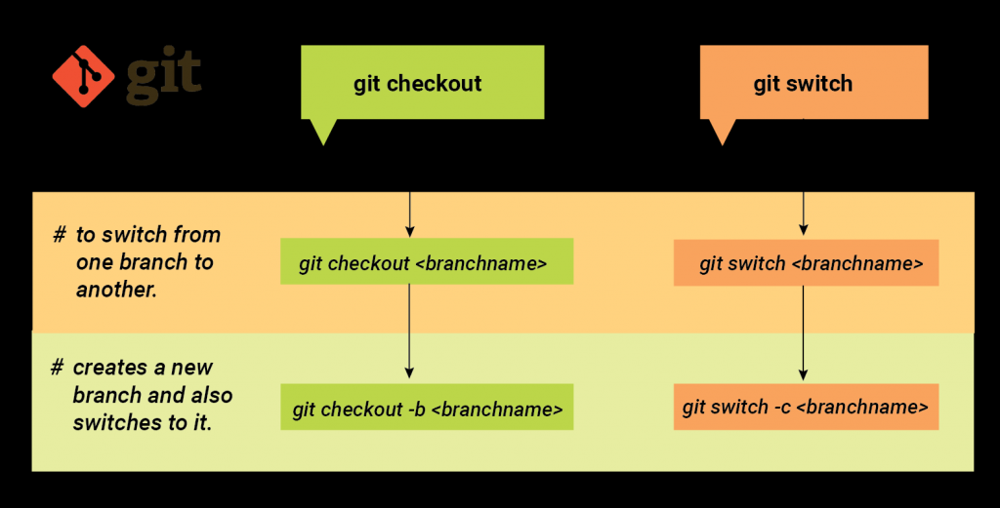

# Checkout - being able to switch between different versions of the target entity. It can be used on three different targets: branches, commits, and files.
An example of how to use the following command, using the a branch as the target entity, would go as follows: 
$> git branch master another_branch example_branch $> git checkout example_branch
In this example a list of available branches is viewed and switched to example_branch

