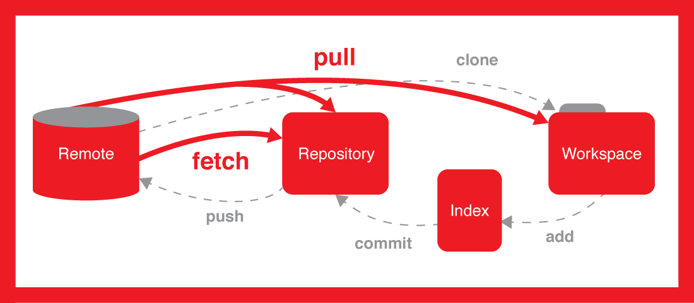

Remote Add / Remove / Show - allows for you to do different things to remote repositories. In this case, you can add, remove, and show remote repositories. 
It can show which remotes are connected currently (show), add new connections (add), and remove existing connections (remove). Here are some examples:
 git remote -v 
git remote add example https://test@github.com/test/example.git
 git remote remove example
These examples show, add, and remove.

