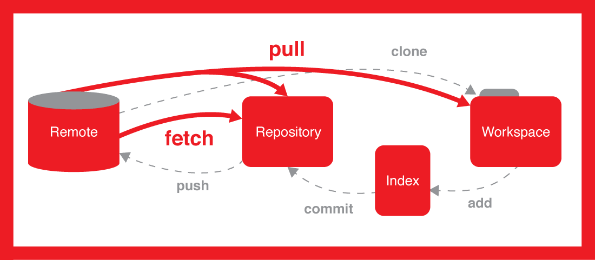

Repository -  A directory or storage space where your projects can live. Sometimes GitHub users shorten this to “repo.” 
It can be local to a folder on your computer, or it can be a storage space on GitHub or another online host. 
You can keep code files, text files, image files, you name it, inside a repository.

